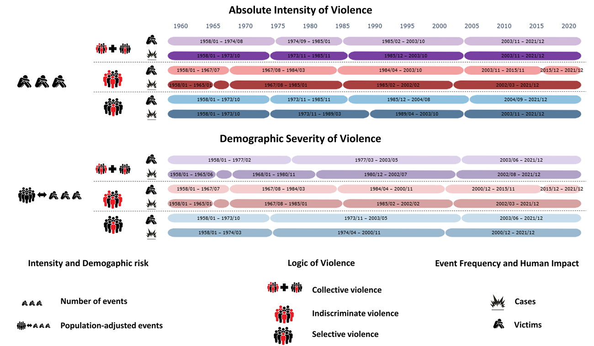
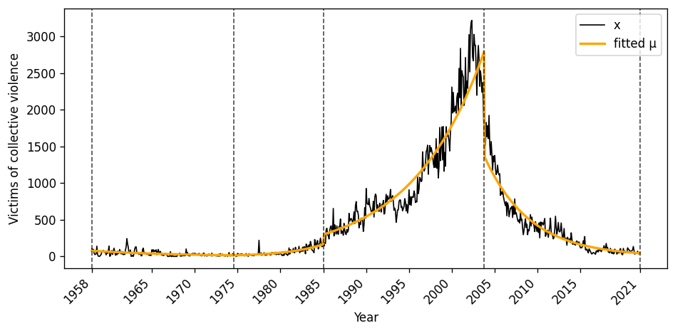
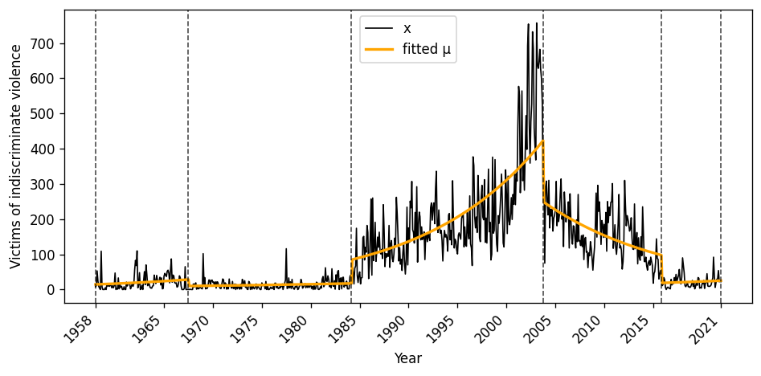

# 🧠 Multidimensional Periodization of Internal Armed Conflict

 Colors indicate statistically homogeneous regimes detected by the NB-GLM model for different violence indicators.

## 🔍 Project Overview

This project introduces a **computational framework for the periodization of internal armed conflicts**, based on a **Negative Binomial Generalized Linear Model (NB-GLM)** combined with **change-point detection**.

The method is designed to capture:

- 📈 Escalation and de-escalation dynamics  
- 📊 Overdispersed violence counts  
- 🧩 Multiple dimensions of violence  
- 🌍 Population-adjusted risk  
- ⏳ Structural regime changes over time  

The approach is illustrated using **monthly data from the Colombian internal armed conflict (1958–2021)**.

---

## 🧩 Why this matters

Traditional conflict periodization often relies on:

- arbitrary temporal divisions,
- visual inspection,
- or models assuming constant variance.

However, **internal armed conflicts violate these assumptions** due to:
- extreme heterogeneity,
- clustering of events,
- demographic effects,
- changing targeting strategies.

This project proposes a **statistically coherent alternative**, explicitly modeling:

✔ Overdispersion  
✔ Temporal trends  
✔ Population scaling  
✔ Multidimensional violence dynamics  

---

## 🧠 Methodological Framework

The project identifies structural regimes in internal armed conflict using a statistical change-point approach.

### 🔹 Multidimensional representation
Violence is analyzed across three dimensions:
- **Intensity vs. risk** (absolute vs population-adjusted)
- **Logic of violence** (selective vs indiscriminate)
- **Human impact** (events vs victims)

---

### 🔹 Distributional assessment
Violence data are tested using:
- Weighted KS tests  
- Kernel-based segmentation  

➡️ Results show strong **overdispersion**, rejecting Poisson and Gaussian models.

---

### 🔹 Change-point model
A **Negative Binomial GLM** is used to:
- Model overdispersed counts  
- Capture escalation/de-escalation trends  
- Incorporate population effects  

The model detects **structural regime changes**.

---

### 🔹 Multidimensional periodization
Each indicator produces its own segmentation, revealing that:

- Conflict phases differ across dimensions  
- Regimes do not fully align  
- Violence dynamics depend on how violence is measured

## 📊 Example Results

### Multidimensional regime structure

The GLM–NB model locates regime changes **closer to empirical violence peaks**, reducing segmentation error and improving interpretability.

---

## 📁 Repository Structure

The source code and the data is available at:  
[GitHub repository](https://github.com/fagomez/nbglm)

The project is organized as follows:

<pre>
nbglm/
├── notebooks/        # Analysis notebooks
├── data/             # Violence data
├── docs/             # Project webpage
│   └── index.md
├── assets/           # Figures used in the webpage
├── README.md
└── requirements.txt
</pre>

## 📄 Citation

This work is currently **under review at PLOS ONE**.

If you wish to cite this work while it is under review, please use the following reference:

<pre> 
@unpublished{Gomez2026NBGLM,
  title   = {A Negative Binomial GLM Change-Point Model for Multidimensional Conflict Periodization},
  author  = {Castro, Cristiam and G{\'o}mez, Francisco},
  year    = {2026},
  note    = {Manuscript under review at PLOS ONE}
}
</pre>

